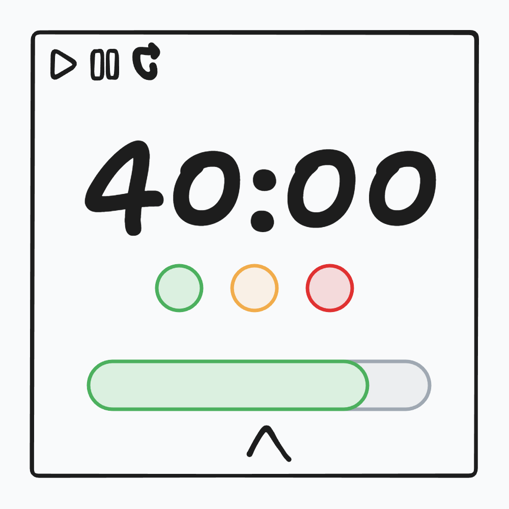

# Semaforo

Simple pomodoro app from low-fidelity wireframes using React + Typescript + Tailwind.

Named after the word for traffic light in Italian.

## Features

- [x] 40-minute focus & 20-minute breaks sessions with visual timer display
- [x] Adjust session interval
- [ ] Audio notifications
- [ ] Session tracking
